# Devoxx Belgium 2026: Google-colored LED visuals ✨

64×64 visuals for the [Google Cloud Raffle](https://devoxx-raffle.cloud.run/) LED matrix, built with
[Jixoo](https://github.com/glaforge/jixoo) (Java 21) and **Nano Banana** (Gemini image generation).

Everything uses the Google palette (blue `#4285F4`, red `#EA4335`, yellow `#FBBC05`, green `#34A853`) and the Gemini
blue → violet → rose gradient.

| google-dots | gemini-sparkle | google-spinner | matrix-rain | devoxx-gemini |
|---|---|---|---|---|
| 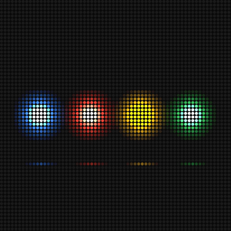 | 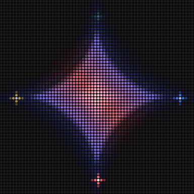 | 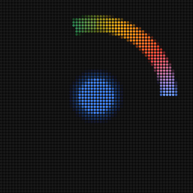 | 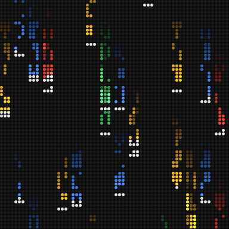 | 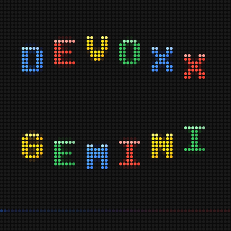 |

### dev-runner v2: World Tour

A remake of dev-runner starring the **Nano Banana developer**: Nano Banana 2 drew his run cycle, jump and landing as a
sprite sheet using `nano-developer` as the reference image ([`assets/nano-developer-runsheet_v1.png`](assets/nano-developer-runsheet_v1.png)).
He runs through **Jungle → Beach → City → BouncyLand → Grass** and back into the Jungle in one continuous shot:
stomping bugs, grabbing Google G coins, bouncing on trampolines, with the Google Cloud companion floating along.

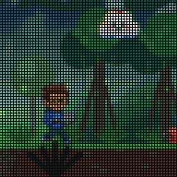

- **25 fps, 24 s, 600 frames**, seamless loop. Five parallax layers (sky, horizon, mid, near, foreground) plus the
  ground; themes are regions of the world, so far scenery of the next theme peeks in from the right and the ground
  changes under his feet. No fades or wipes.
- Files: `output/dev-runner_v2-world-tour.gif` and `.mp4`. Storyboard:
  [`storyboards/dev-runner-world-tour.md`](storyboards/dev-runner-world-tour.md).

### Google-Gemini-Fly-Though-Exciting-World-Of-Possibilities (hero entry)

GOOGLE is typed with a cursor, the camera dives through the O into a tunnel of swirling Google-colored smoke, the
smoke burns away to reveal a candyland world mixed with IT (candy-striped mountains, rivers and waterfalls, lollipop
trees, glowing circuit traces with racing data packets, server towers), the camera shoots up through colorful clouds
until the world becomes a planet, and the planet flies over to become the dot on the "i" of GEMINI, where a Gemini
sparkle flashes, before everything poofs into colorful dust and the loop starts again from black.


- **25 fps, 16 s, 400 frames**, seamless loop (black to black), rendered at 128×128 and downsampled for sub-pixel smooth motion.
- Smoke is domain-warped gradient noise ([`Noise.java`](src/main/java/io/github/rolfdobbelaere/ledart/Noise.java));
  the world is a procedural height and color map rendered voxel-space style, and the same map is wrapped onto the planet.
- Files: `output/google-gemini-fly-through_v1-25fps.gif` and a 512×512 nearest-neighbour `.mp4` of the same frames.
- Storyboard: [`storyboards/google-gemini-fly-through.md`](storyboards/google-gemini-fly-through.md).

### coffee-factory v4: the Pixar-style 3D remake

The coffee factory story retold as a little animated short. The DEVOXX cup is the hero: it sleeps while the claw
sets it down, wakes up in a close-up, looks up at each dispenser in anticipation, closes its eyes in bliss at the
coffee, is amazed by the Gemini swirl (wrapped in swirling colored smoke and sparkles), blushes when DEV ♥ sprinkles
it with love, giggles through the jiggle and is carried away, leaving a glossy glowing heart.


- **Real 3D** on 64×64: every pixel is ray marched through signed distance functions (hollow tapered cup, coffee,
  soft-serve of stacked tori, belt, rollers, dispensers, claw, puffy heart) with soft shadows, ambient occlusion,
  glossy highlights, a warm key light, a cool fill, a violet rim light, ACES tone mapping and Google-colored bokeh
  ([`CoffeeFactory3D.java`](src/main/java/io/github/rolfdobbelaere/ledart/CoffeeFactory3D.java)).
- **25 fps, 20 s, 500 frames**, black to black. Files: `output/coffee-factory_v4-gemini-label.gif` and `.mp4`.
- **v4** gives the Gemini dispenser a wide signboard and draws **GEMINI** pixel-exact on the LED grid so the name stays
  readable during the rainbow swirl (v3 only showed the sparkle icon).
- Storyboard: [`storyboards/coffee-factory-pixar-3d.md`](storyboards/coffee-factory-pixar-3d.md).

### coffee-factory: the Devoxx coffee line

A robot claw places a DEVOXX cup on a conveyor belt. The camera follows the cup (it stays centred while belt and
dispensers scroll past) through three stations: **JAVA** pours coffee (steam rises, a drop sloshes out when the cup
moves on), **Gemini** builds a rainbow soft-serve swirl, and **DEV ♥** adds pink sprinkles while little hearts float
up. The topping jiggles, the claw lifts the cup away, and a heart is left behind before everything fades to black.

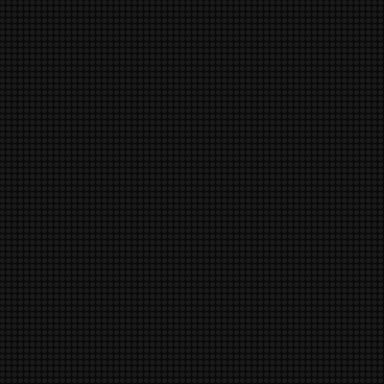

Storyboard: [`storyboards/coffee-factory-love-story.md`](storyboards/coffee-factory-love-story.md).

The story is written on a timeline in seconds (1 s travel between stations, 1 s pause before and after each pour)
and sampled into frames that each have their own delay:

| Version | Frames | Length | Notes |
|---|---|---|---|
| `coffee-factory_v4-gemini-label.gif` | 500 | 20 s | 3D remake with a readable GEMINI sign |
| `coffee-factory_v3-pixar3d.gif` | 500 | 20 s | Pixar-style 3D remake, 25 fps; Gemini shown as icon only |
| `CHOSEN_coffee-factory_v2-smooth.gif` | 137 | ~20 s | ~10 fps while moving; chosen, the booth display plays long GIFs |
| `coffee-factory_v2-pixoo30.gif` | 30 | ~20 s | same timing; each pause is one 1-second frame (Pixoo 64 plays only ~30 frames) |
| `coffee-factory_v1-fast.gif` | 30 | ~3.6 s | first version, too fast to read the dispensers |

### googly-letters: GOOGLE meets DEVOXX

Letters with googly eyes jump in one by one, land with squash-and-stretch and dust puffs, look around and blink,
then all turn to look at a friendly Google Cloud that swooshes in and blows them off screen, leaving sparkles
that fade back to black. Letters are drawn analytically and supersampled 3x3, so they can rotate and stretch
smoothly; per-frame delays let the hold linger and the swoosh rush, within the Pixoo's 30-frame limit.


### Generated with Nano Banana 2

| Nano Banana source | 64×64 on the LED wall (shimmer) |
|---|---|
|  | 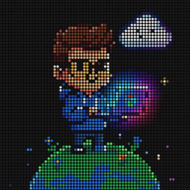 |
| 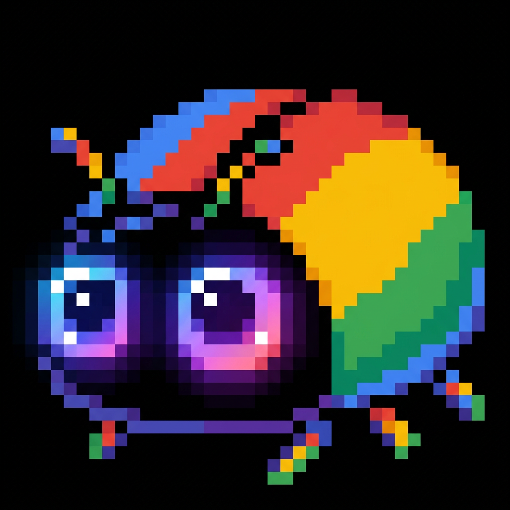 | 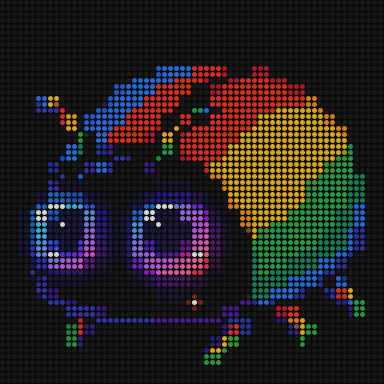 |

### dev-runner: a side-scroller loop

A developer runs over a curved Google-colored planet, stomps a red and a green bug, bounces through a spinning
Google "G" coin, and passes a keyboard and mouse, while a smiling Google Cloud floats above like Lakitu.
The world scrolls exactly 90 px in 30 frames and every object repeats every 90 px, so the loop is seamless.

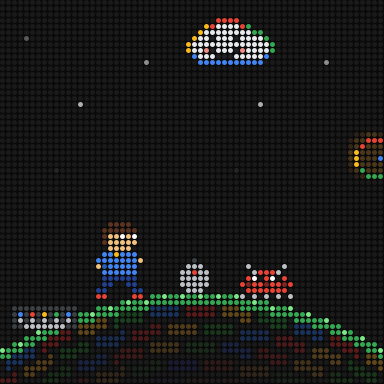

*Previews are upscaled to show the LED look. The real 64×64 files to upload are in [`output/`](output).*

## How it works

- **Procedural scenes** ([`Scenes.java`](src/main/java/io/github/rolfdobbelaere/ledart/Scenes.java)): drawn on an
  additive-light canvas so overlapping colors glow like real LEDs. Each loops seamlessly in exactly 30 frames, because
  the Pixoo 64 only plays the first ~30 frames of a GIF.
- **Nano Banana pipeline** ([`NanoBanana.java`](src/main/java/io/github/rolfdobbelaere/ledart/NanoBanana.java),
  [`PixelArt.java`](src/main/java/io/github/rolfdobbelaere/ledart/PixelArt.java)): your subject gets wrapped in a
  prompt that asks for chunky Google-colored pixel art on pure black. The result is center-cropped and downsampled
  with a per-block median (keeps pixel edges sharp). Near-black becomes "LED off" and colors snap to the Google
  palette. A second, animated version adds a Gemini shimmer sweep and twinkles.
- **Jixoo** does the image decoding (`ImageProcessor`), the frame model (`PixooImage`, `PixooFrame`,
  `PixooAnimation`) and the GIF89a encoding (`GifEncoder`). If you have a Pixoo, `pixoo-cli gif -f output/x.gif`
  shows the result on the device.

## Build

Requires Java 21 and Maven. Jixoo isn't on Maven Central, so install it locally first:

```bash
git clone https://github.com/glaforge/jixoo.git
cd jixoo && mvn install -DskipTests && cd ..
```

Then, in this repo:

```bash
mvn -q compile exec:java -Dexec.args="scenes"
```

Render one scene, or a contact sheet of all its frames:

```bash
mvn -q compile exec:java -Dexec.args="scene dev-runner"
mvn -q compile exec:java -Dexec.args="sheet dev-runner"
```

Iterations are kept side by side as `name_v#-comment`; pass the output name as an extra argument:

```bash
mvn -q compile exec:java -Dexec.args="scene coffee-factory coffee-factory_v2-smooth"
```

## Generate with Nano Banana

```bash
mvn -q compile exec:java -Dexec.args="ai 'a cute robot mascot holding a coffee cup' robot"
```

This writes `output/robot.gif` (still), `output/robot-shimmer.gif` (animated) and previews plus the raw Gemini image
in `output/preview/`. Add `--snap` to force every pixel onto the Google palette (the default keeps Nano Banana's colors, which looks
better for characters). `convert <image> <name>` re-processes an image you already have, without a new API call.

### Google Cloud setup

1. Use the Google Cloud project that holds the Devoxx credits, and check that **Billing → Credits** shows them.
2. Enable the **Generative Language API**: *APIs & Services → Library*, search for it, then click **Enable**.
3. Create a key: *APIs & Services → Credentials → Create credentials → API key*. Under *API restrictions*, select
   **Gemini API**. Google then asks you to bind the key to a **service account**: create one (e.g. `nano-banana`, no
   roles needed) and select it. Click **Create** and copy the key with the copy button.
4. Store the key as an environment variable (never commit it):
   - Windows: *Edit environment variables for your account → New*, name `GEMINI_API_KEY`, then open a new terminal.
     Or in PowerShell: `setx GEMINI_API_KEY "your-key"` (also needs a new terminal).
   - macOS/Linux: `export GEMINI_API_KEY="your-key"` in your shell profile.

   As a fallback, the app also reads `GEMINI_API_KEY=...` from a git-ignored `.env` file in this folder.
5. Optional: run `mvn -q exec:java -Dexec.args="models"` to list the image models your key can use, and set
   `GEMINI_IMAGE_MODEL` if the default (`gemini-3.1-flash-image`, Nano Banana 2) isn't one of them.

**Free tier only?** If the Gemini API answers `RESOURCE_EXHAUSTED ... free_tier ... limit: 0`, your project is on the
free tier (common with credit-only billing accounts). Use Vertex AI / Agent Platform instead, which bills to your
Cloud billing account and credits:

1. Enable the **Agent Platform API** (`aiplatform.googleapis.com`).
2. Give the service account the **Agent Platform user** role (*IAM → Grant access*).
3. Create a key restricted to the **Agent Platform API**, bound to that service account.
4. Add to `.env`:
   ```
   GEMINI_BACKEND=vertex
   GOOGLE_CLOUD_PROJECT=your-project-id
   ```

## Credits

[Jixoo](https://github.com/glaforge/jixoo) by Guillaume Laforge (Apache 2.0).
